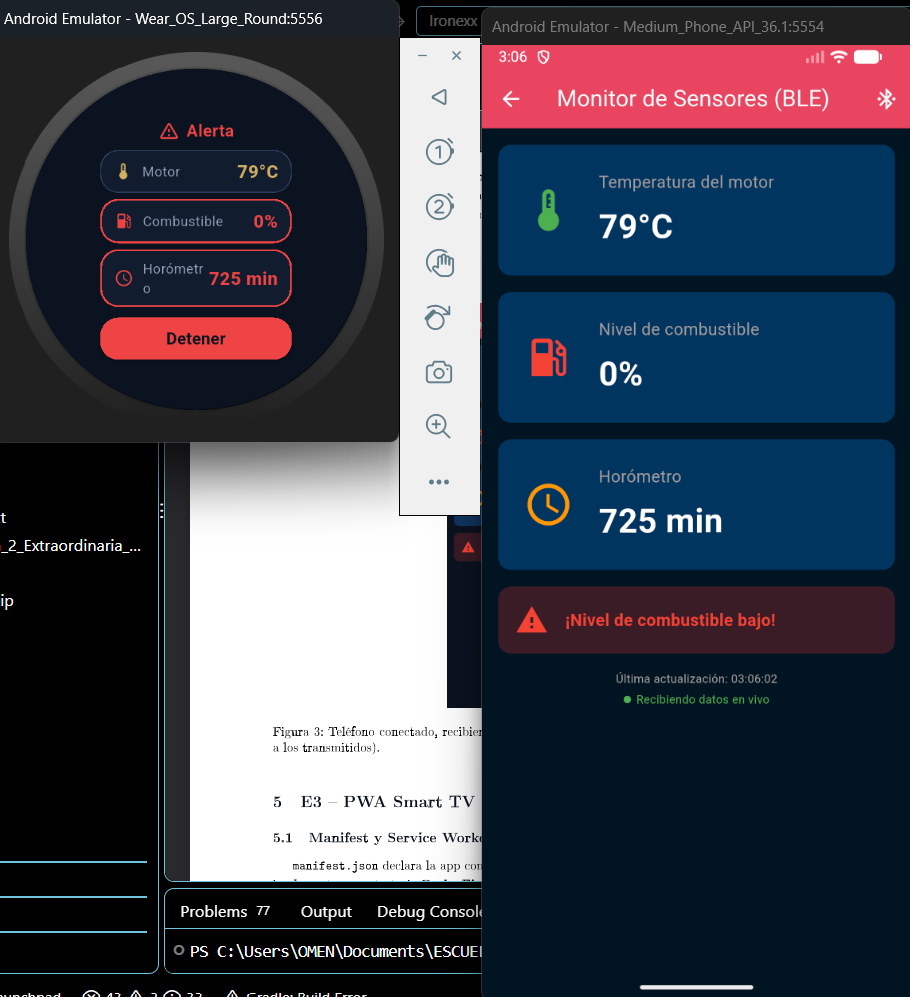
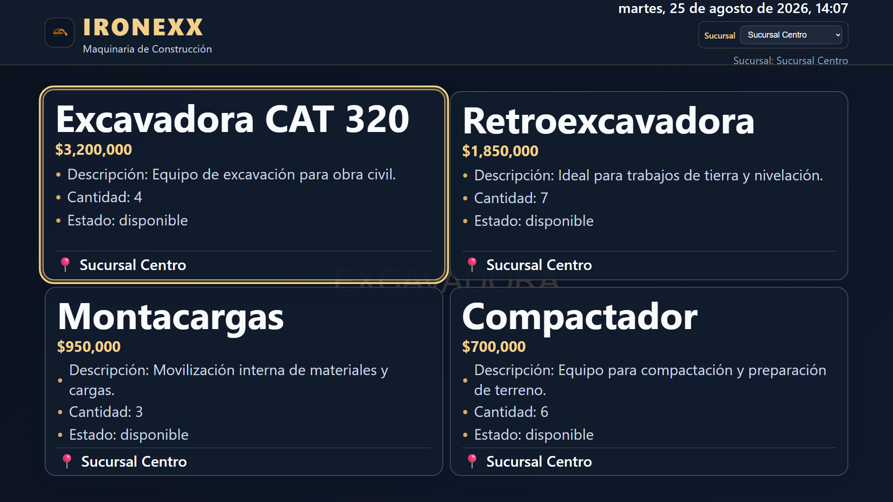
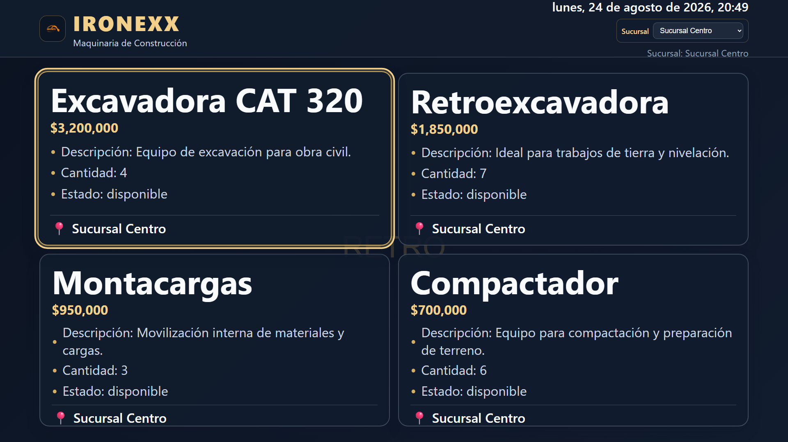
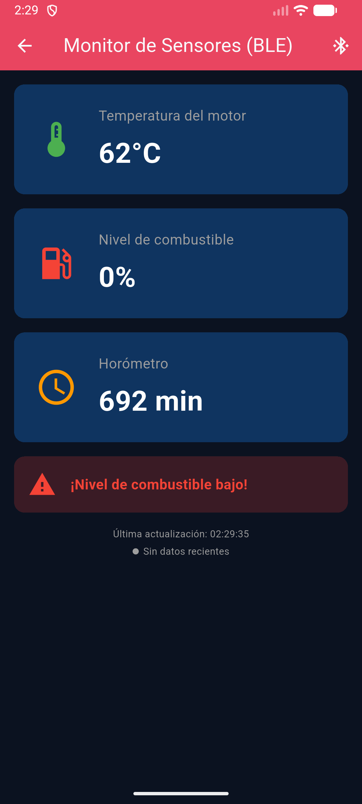

# Ironexx - Ecosistema Wear OS + Firestore + Smart TV

Ecosistema de dispositivos inteligentes para la materia de Desarrollo para Dispositivos Inteligentes,
Evaluación 2 Extraordinaria. Documento formal completo (arquitectura, evidencias, problemas y soluciones)
en `reporte_extraordinaria/main.pdf` (fuera de este repositorio).

## Descripción del proyecto

Un reloj Wear OS monitorea el estado operativo de una máquina de construcción (temperatura del motor,
nivel de combustible, horómetro) y lo transmite por Bluetooth Low Energy a un teléfono. Desde el teléfono
se puede consultar el catálogo de maquinaria y seleccionar una máquina, lo que se sincroniza en tiempo real
a una Smart TV (PWA) vía Firebase Firestore. El ecosistema consta de tres aplicaciones:

1. **wearable_app (Wear OS, Flutter)**: simula 3 métricas de la máquina y las publica por BLE GATT Server
   con notificaciones (NOTIFY).
2. **mobile_app (Android, Flutter)**: cliente BLE que se conecta al reloj y muestra las métricas en tiempo
   real; permite además consultar/seleccionar maquinaria y sincronizarla a Firestore.
3. **pwa_tv (HTML/CSS/JS, sin build step)**: Progressive Web App para Smart TV (1920×1080, navegación
   D-pad, offline vía Service Worker) que refleja en tiempo real la máquina seleccionada desde el teléfono.

## Estructura del proyecto

```
ironexx_dispo/
├── mobile_app/          # Aplicación móvil Flutter (cliente BLE + Firestore)
├── wearable_app/        # Aplicación Wear OS Flutter (servidor GATT BLE)
├── pwa_tv/               # PWA para Smart TV (lee Firestore con onSnapshot)
├── docs/extraordinaria/ # Aviso de privacidad, checklist de seguridad, plan de retención
└── README.md             # Este archivo
```

## Requisitos previos

- Flutter 3.44.0 / Dart 3.12.0, Android Studio 2025.3.1 con plugins Flutter/Dart, JDK 21.
- Emulador Wear OS (`Wear_OS_Large_Round`, API 36) y emulador de teléfono (`Medium_Phone_API_36.1`), ambos
  con Android Emulator ≥36.5 (para que el controlador Bluetooth virtual/Netsim funcione entre los dos).
- Navegador basado en Chromium (para la PWA) y un servidor HTTP estático (Python o Node) para servirla.
- Acceso al proyecto Firebase `ironexx-extraordinaria` (el `google-services.json` y el `apiKey` web ya
  están incluidos en este repositorio — no son secretos de servidor, ver sección Seguridad).

## Instrucciones de ejecución

### 1. wearable_app (reloj)

```bash
cd wearable_app
flutter pub get
flutter run   # seleccionar el emulador Wear OS
```

Presiona **Iniciar** en la pantalla para arrancar el simulador de métricas y el advertising BLE.

### 2. mobile_app (teléfono)

```bash
cd mobile_app
flutter pub get
flutter run   # seleccionar el emulador de teléfono
```

Con el reloj ya transmitiendo, entra a "Monitor BLE del wearable" y presiona **Buscar reloj**.

### 3. pwa_tv (Smart TV)

```bash
cd pwa_tv
python -m http.server 8080
```

Abre `http://localhost:8080` en un navegador a 1920×1080. Al seleccionar una máquina en el teléfono
("Buscar máquina"), la TV se actualiza sola sin recargar.

## Flujo de datos (arquitectura obligatoria de la guía)

```
Wear OS --BLE GATT/NOTIFY--> Teléfono --setDoc()/set(merge:true)--> Firebase Firestore
                                                                          |
                                                                    onSnapshot()
                                                                          v
                                                                     Smart TV/PWA
```

La comunicación teléfono → TV se realiza **únicamente mediante Firebase Firestore** (no se usa
BroadcastChannel, HTTP, WebSocket ni SSE para eso). `BroadcastChannel` solo se usa como mecanismo auxiliar
local dentro del propio navegador de la TV, con validación de `event.origin`.

## Configuración BLE

**UUIDs (custom, no reservados del SIG Bluetooth) — centralizados en `ble_constants.dart`, idénticos en
`wearable_app` y `mobile_app`:**
- Service UUID: `e2bca587-9a7c-419f-bc59-975f76d22b75`
- Temperatura (característica): `de952db7-c3e7-4d5d-b529-dd33bddedaf0`
- Combustible (característica): `27d5880c-69bc-4560-9786-d9eeb421e473`
- Horómetro (característica): `21eb1556-c1c4-4c1f-8bc4-aea8263f2afb`

Protocolo de payload: cada característica notifica un `Int32` little-endian independiente (4 bytes).

### Umbrales críticos

- Temperatura del motor: > 100 °C
- Nivel de combustible: < 15 %
- Horómetro: > 60 min (mantenimiento recomendado)

## Firestore

Colección `estado_tv`, documento `actual`, campos `machineId` (opcional), `machineName`, `branch`,
`updatedAt`. El teléfono escribe con `set(..., SetOptions(merge: true))`; la TV escucha con `onSnapshot()`.

> **Nota de vigencia:** el proyecto de Firebase corre en modo de prueba (reglas abiertas), que expira 30
> días después de creado (creado 24-ago-2026 → expira ~23-sep-2026). Si vas a usar este proyecto después de
> esa fecha, actualiza las reglas de Firestore en Firebase Console antes de intentar correr el ecosistema.

## Seguridad

### Permisos y privacidad

- **LFPDPPP**: ver `docs/extraordinaria/aviso_privacidad.md` (responsable, datos, finalidad, derechos ARCO).
- **Retención de datos**: ver `docs/extraordinaria/plan_retencion_datos.md` — los datos de sensores/
  Firestore de este ecosistema son transitorios por diseño (no hay historial persistente).
- Checklist técnico completo de seguridad: `docs/extraordinaria/checklist_seguridad_pwa.md`.

### Content Security Policy (PWA, `pwa_tv/index.html`)

```html
<meta http-equiv="Content-Security-Policy"
      content="default-src 'self';
               connect-src 'self' http://localhost:3000 http://127.0.0.1:3000
                 https://firestore.googleapis.com https://www.googleapis.com;
               script-src 'self' https://www.gstatic.com;
               style-src 'self';
               img-src 'self' data: https:;
               media-src 'self' https:;">
```

### Validación de origen (BroadcastChannel, uso local auxiliar)

```javascript
channel.onmessage = (event) => {
    if (event.origin !== window.location.origin) {
        console.warn('BroadcastChannel: origin inesperado, mensaje ignorado', event.origin);
        return;
    }
    // Procesar mensaje...
};
```

## Evidencia visual

**E1/E2 — reloj y teléfono conectados por BLE, valores idénticos en vivo:**



**E3 — grid de la Smart TV (PWA), 4 tarjetas completas, foco visible:**



**E4 — la TV se actualiza sola al elegir una máquina en el teléfono (Firestore, <2s):**



**E5 — desconexión BLE a media conexión, sin crash:**



Inventario completo de evidencias (con ID único por criterio) en `reporte_extraordinaria/main.pdf`.

## Pruebas

| Prueba | Resultado |
|---|---|
| Wear: Iniciar → 3 métricas cambian → Detener | Verificado en vivo |
| BLE NOTIFY: teléfono recibe sin polling | Verificado en vivo |
| Desconexión BLE a media conexión | Sin crash, estado visible |
| D-pad: flechas + Enter, límites no rompen foco | Verificado (Playwright) |
| Offline: Service Worker sirve la app sin red | Verificado (Playwright) |
| Firestore: 3 corridas cronometradas, meta <2s | 247 ms / 565 ms / 182 ms |
| Multimedia: fallback visual si falla un recurso | Verificado en código |

Detalle completo, evidencias e IDs (`E1-EV01`, etc.) en `reporte_extraordinaria/main.pdf`.

## Configuración de emuladores

### Teléfono
- Modelo: `Medium_Phone_API_36.1` (equivalente genérico a "Pixel 10" en Android Studio actual)
- API: 36.1, Android 16 "Baklava", x86_64

### Wear OS
- Modelo: `Wear_OS_Large_Round`
- API: 36.0, Android 16 "Baklava", x86_64

### PWA en navegador
- Resolución: 1920×1080
- Probado en Brave/Chromium (sin necesidad de un User-Agent especial: la PWA no hace detección de UA)

## Dependencias principales

### wearable_app
- `ble_peripheral: ^2.4.0` — GATT Server (rol periférico)
- `permission_handler: 11.3.1` — permisos runtime

### mobile_app
- `flutter_blue_plus: 1.31.0` — GATT Client (rol central)
- `permission_handler: 11.3.1` — permisos runtime
- `firebase_core` / `cloud_firestore` — sincronización con la Smart TV
- `provider` — gestión de estado

## Archivos sensibles

⚠️ Nunca subir a git: `.env`, `.jks`, `.keystore`, `key.properties`. `google-services.json` y el `apiKey`
web de Firebase **sí** están incluidos a propósito (no son secretos de servidor — ver
`docs/extraordinaria/checklist_seguridad_pwa.md`), para que el proyecto sea reproducible por el profesor.

## Autor

- **Nombre**: Zoé Cabrera Velázquez
- **Matrícula**: 2023171054
- **Grupo**: IDGS16
- **Carrera**: Ing. Desarrollo y Gestión de Software
- **Institución**: Universidad Tecnológica de Querétaro

## Licencia

Proyecto desarrollado con fines educativos para la materia de Desarrollo para Dispositivos Inteligentes.
